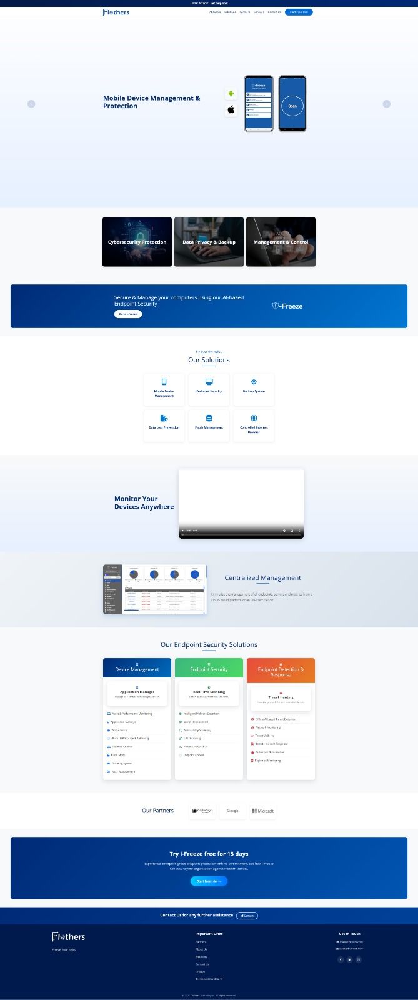

# Flothers Corporate Website

Official corporate website developed for **Flothers Technologies**, designed to showcase the company’s cybersecurity products, endpoint protection solutions, and enterprise security services.

The website provides information about the company, its products, solutions, partners, and allows potential customers to request demos or contact the company.

> ⚠️ Source code is not included in this repository because it is proprietary and owned by the company.

---

# Overview

The Flothers corporate website serves as the main digital presence for the company, presenting its cybersecurity platform and enterprise solutions in a modern and responsive interface.

The website focuses on providing clear product information, strong visual presentation, and easy navigation for enterprise clients.

---

# Key Features

- Modern corporate landing page
- Product and solutions showcase
- Endpoint security product presentation
- Demo request functionality
- Customer feedback submission
- Contact and communication channels
- Legal and policy pages
- Responsive design for all devices
- SEO-friendly page structure

---

# Website Sections

The website consists of multiple pages including:

- Home Page
- About Us
- Solutions
- Services
- Contact Us
- Demo Request
- Customer Feedback
- Login / Admin
- Privacy Policy
- Terms and Conditions
- User Agreement

---

# Technologies Used

- HTML5
- CSS3
- JavaScript
- Bootstrap
- jQuery
- Apache / .htaccess configuration

---

# Architecture

The website follows a **static frontend architecture** with modular components:

```
Root
│
├── css
├── js
├── img
├── webfonts
├── uploads
│
├── index.html
├── about-us.html
├── services.html
├── solutions.html
├── contact-us.html
├── demo_request.html
└── policy & legal pages
```

Assets are organized to separate styles, scripts, images, and fonts for maintainability and performance.

---

# My Role

As a **Senior .NET Developer**, I contributed to:

- Designing and implementing the website frontend
- Structuring the website architecture
- Building responsive layouts
- Implementing UI components and navigation
- Integrating contact and demo request forms
- Optimizing performance and loading speed
- Preparing the website for deployment

---

# Screenshots

### Dashboard



---

# Project Status

Completed and deployed for production use.

---

# License

This repository exists **for portfolio and documentation purposes only**.

The original source code and intellectual property belong to **Flothers Technologies**.
